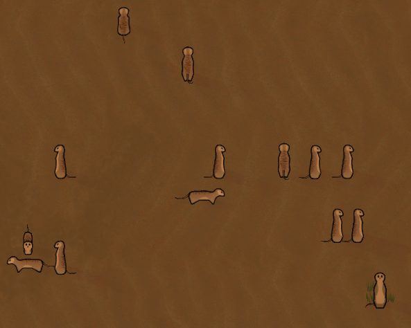

RimWorld - MeerkatMod
===========

Introduction
------------

This is a simple mod for [RimWorld](https://rimworldgame.com/) that adds meerkats
as a creature to the game. It demonstrates how to add a custom animal definition
as well as inject an assembly that adds a modified `Pawn` class that allows the
creature to swap the texture based on some context (in this case, whether the
creature is moving).

Usage
-----

Simply clone this repository to your `steamapps/common/RimWorld/Mods` folder.

